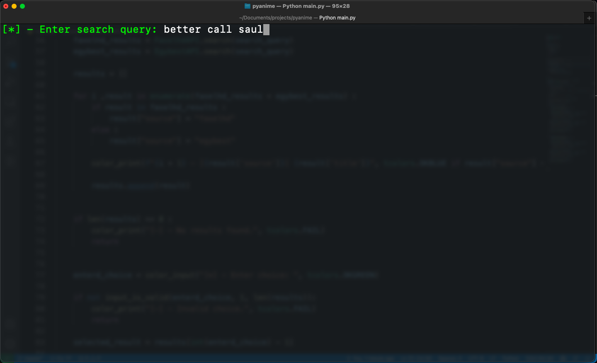
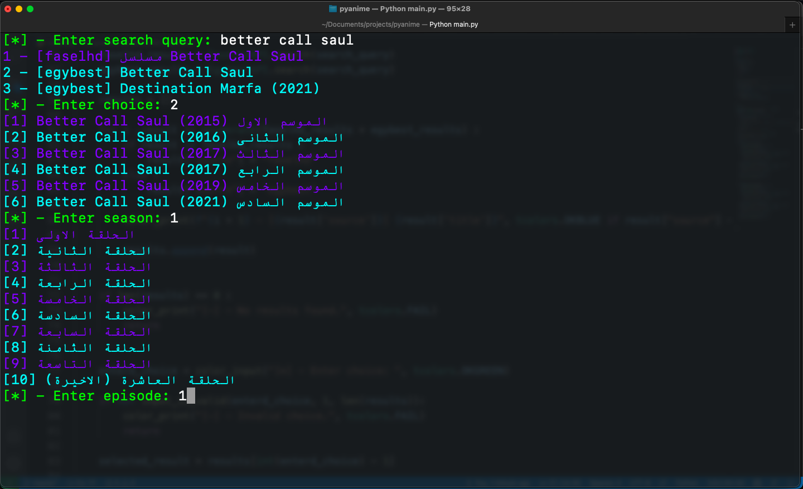

# PYANIME

a cli tool to watch animes and tv shows
even though the name say anime, you can watch tv shows too 

NOTE: movies will be supported in the future.


## Media Players
1. supported media players for now are ```IINA``` and ```MPV```

2. so you need to have one of them installed in your system and specify it in the config file

## Installation

1. first git clone the repo: ```git clone https://github.com/Modalessi/pyanime```

2. create a virtual environment: ```python3 -m venv enviromentName```

3. activate the virtual environment: ```source enviromentName/bin/activate```

4. install the requirements: ```pip install -r requirements.txt```

5. run the app: ```python3 pyanime.py```


## Usage

1. after you run the tool using ```python pyanime.py``` it will prompt you to enter a search query 
   
   
2. enter the number of the result you want to watch:
   
   
3. enter the number of the episode you want to watch:
   
   
4. the episode will open and a controller will show up for you in order to move forward, backward or exit the app
   
   
5. enjoy!
