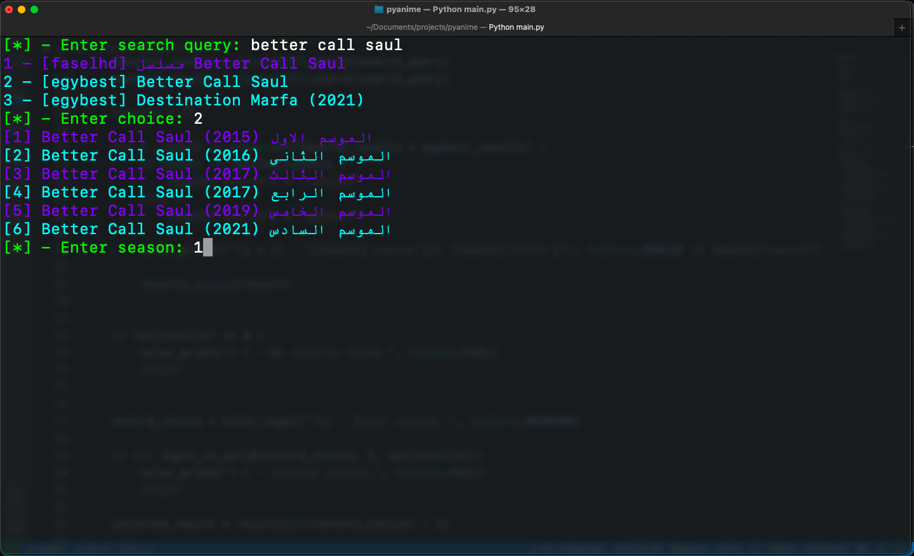

# PYANIME

a cli tool to watch animes, tv shows and movies for free and without ads ;)
it does it by scrapping Faselhd and egybest websites


## Media Players
1. supported media players for now are ```IINA``` and ```MPV```

2. so you need to have one of them installed in your system and specify it in the config file

3. you can install MPV from here https://mpv.io/installation/
   
4. you can install IINA from here https://iina.io/

## Installation

1. first git clone the repo: ```git clone https://github.com/Modalessi/pyanime```

2. create a virtual environment: ```python3 -m venv enviromentName```

3. activate the virtual environment: ```source enviromentName/bin/activate```

4. install the requirements: ```pip install -r requirements.txt```

5. run the app: ```python3 main.py```


## Usage

1. after you run the tool using ```python3 main.py``` it will prompt you to enter a search query :
   
   
2. enter the number of the result you want to watch (egybest is recommended) :
   
   
3. if the show has more than one season it will ask you to enter the season number:
   
   
4. enter the episode number that you want to watch:
   
   

5. enjoy ;)
   
